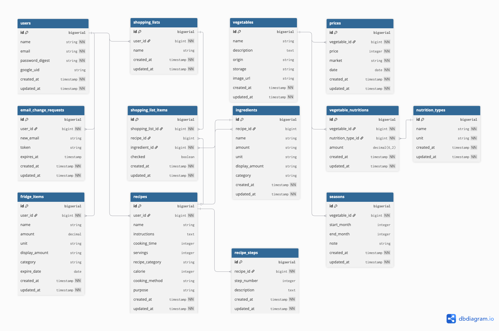

# **VegeGuide** – 忙しいあなたの、毎日の “ちょうどいい健康習慣”
---

> 忙しい社会人のための野菜選び・レシピ提案・食材管理サービス  
>  
> ### 🔗 [実際のサービスはこちら](https://vegeguide.com/)
>
> ## 各リポジトリ一覧

- [Backend](https://github.com/pekoemood/vegeguidebackend)
- [Frontend](https://github.com/pekoemood/vegeguidefrontend)

## 📌 サービス概要

**VegeGuide**は、忙しい社会人が**スーパーで野菜を選ぶ瞬間**から**冷蔵庫で食材を管理する**まで、野菜を中心とした食生活を一元的にサポートするWebサービスです。

ユーザーは、**旬で安い野菜を選び、AIが提案するレシピで効率的に調理し、食材を無駄にしない**という結果を得られます。料理初心者でも健康的でコスパの良い食生活を継続できるようになります。

---

## 🛠️ 開発背景

私自身が社会人になった際、自炊を始めようとしたときに感じた課題がきっかけです。

- スーパーで野菜を見ても「何が安いのか」「どう調理すればいいのか」がわからない  
- 野菜を買っても使い切れずに腐らせてしまう  
- 健康的な食事を心がけたいが、レシピを考えるのが面倒  
- 食材の栄養価や保存方法などの基本的な知識が不足  

これらの問題を解決するため、**野菜選び初心者でも迷わず、効率的に健康的な食生活を送れる**サービスを開発しました。

---

## 🎯 ターゲット層

**メインターゲット**: 独身男性社会人（27歳〜34歳）  
**ペルソナ**: 田中さん（30歳、IT企業勤務、都内一人暮らし）

- 年収500万円程度、残業多め  
- 健康診断の数値が気になり始めた  
- 料理経験は浅く、野菜の選び方がわからない  
- 食費を抑えたいが、コンビニ弁当に頼りがち  
- 時短・簡単な調理法を求めている  
  
---

## 📣 ユーザー獲得方法
1. **技術ブログでの発信**: Qiita・Zennで開発ストーリーを発信  
2. **SNSマーケティング**: Twitter・InstagramのグルメハッシュタグでのPR投稿  

---

## 🧭 サービス利用のイメージ

### 🔁 利用フロー
1. **仕事帰りにアプリを開く** → 今日安い旬の野菜を確認  
2. **スーパーで迷わず買い物** → 価格情報を見ながら効率的に食材選択  
3. **帰宅後すぐに調理開始** → AIが提案するレシピで簡単調理  
4. **余った食材を冷蔵庫に登録** → 次回のレシピ提案で無駄なく消費  

### 🎁 得られる価値
- **時間短縮**: 食材選びからレシピ検索まで一括で完結  
- **節約効果**: 旬の安い野菜を選ぶことで食費削減  
- **健康改善**: 野菜摂取量が増え、栄養バランスが改善  
- **ストレス軽減**: 「今日何を作ろう」という悩みから解放  

### 🥇 サービス差別化のポイント

**競合サービス**:
- **クックパッド**: レシピ特化、価格情報なし  
- **DELISH KITCHEN**: 動画レシピ、食材管理機能なし  
- **Paprika（海外）**: 食材管理あり、日本の価格データなし  

**VegeGuideの差別化**:
1. **価格×栄養×レシピの三位一体**  
2. **AI活用したパーソナライズ提案**  
3. **冷蔵庫管理連携で無駄を防止**  
4. **男性向けUI/UXで直感的な操作性**  

---

## 🧪 技術スタック

### 🔙 バックエンド

| 技術             | バージョン  | 用途                         |
|------------------|-------------|------------------------------|
| Ruby on Rails    | 7.2.2       | APIサーバー                  |
| PostgreSQL       | -           | メインデータベース           |
| GoodJob          | -           | 非同期処理エンジン           |
| RSpec            | -           | テストフレームワーク |

### 🖥️ フロントエンド

| 技術              | バージョン | 用途                             |
|-------------------|------------|----------------------------------|
| React             | 19.0.0     | UIフレームワーク（最新機能活用）|
| Vite              | 6.2.0      | 高速ビルドツール                 |
| Tailwind CSS      | 4.1.3      | ユーティリティファーストCSS      |
| React Hook Form + Zod | -     | フォーム管理                     |
| Recharts          | -          | データ可視化ライブラリ           |

### 🌐 外部API・サービス

| サービス名              | 用途                          |
|--------------------------|-------------------------------|
| Google Gemini API        | AI文章生成        |
| Cloudinary               | 画像管理サービス  |
| 青果物市況情報Web API    | 野菜価格データ取得|

### ☁️ インフラ・デプロイ

| 技術/サービス  | 用途                        |
|----------------|-----------------------------|
| Docker         | コンテナ化（開発環境）       |
| Render         | バックエンドホスティング     |
| Vercel         | フロントエンドホスティング   |

### 🧰 開発ツール

| ツール      | 用途                  |
|-------------|-----------------------|
| RuboCop     | Ruby静的解析           |
| Biome       | JavaScript静的解析     |
| SimpleCov   | テストカバレッジ測定   |

---

## 🎬 デモ・スクリーンショット

### 🏷️ メイン画面  

### 🤖 AIレシピ生成画面  

### 🧊 冷蔵庫管理画面  

---

## 🚧 今後の展開

### 🐣 短期目標（3ヶ月）
- 📱 レスポンシブデザインの完全対応  
- 🔔 価格通知機能の実装  
- 💬 ユーザーフィードバック機能  

### 🚀 中期目標（6ヶ月）
- 📲 iOS/Androidアプリ版の開発  
- 🗺️ 地域別価格比較機能の強化  
- 🥗 栄養士監修コンテンツの追加  

### 🏢 長期目標（1年）
- 🚚 食材宅配サービスとの連携  
- 🧑‍💼 企業向けBtoBサービスの展開  
- 🌏 海外展開（アジア圏）  

---
## 🗂️ ER図

> ※ 本ER図は主要なドメインモデルを示しています。  
>   ActiveStorageやGoodJobのテーブルは含まれていません。  
